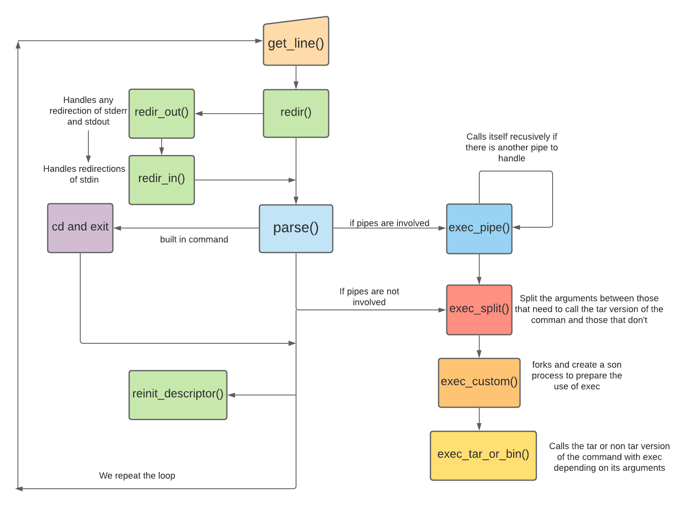

# PROJET DE SYSTEME D'EXPLOITATION

## Fonctionnalités disponibles

Voici les fonctionnalités disponibles du tsh: 

* Affichage du nom de l'utilisateur, nom de la machine et du répertoire courant au début du prompt.

* Fonctionnement normal des commandes lorsqu’un tarball n'est pas impliqué.

* Fonctionnement des commandes `ls` (nottament avec l'option -l), `cp` et `rm` (nottament avec l'option -r) , `mv` , `rmdir`, `cat` , `pwd`, `cd` et `exit` lorsque des tarballs sont impliqués. Les options sont uniquement prises en compte lorsqu'elles sont entrées avant n'importe quel argument. La commande `cd` sans argument renvoit dans le répertoire `home/`.

* Fonctionnement normal des commandes lorsqu'on leur donne plusieurs arguments et que des tarballs sont impliqués ainsi que lorsqu'on on leur donne plusieurs arguments, certains impliquants des tarballs, d'autres non.

* Fonctionnement des redirections `>` , `>>` , `2>` , `2>>` , `<` que des tarballs soient impliqués ou non. Fonctionnement des redirections multiples que des tarballs soient impliqués ou non.

* Fonctionnement normal des combinaisons de commande que des tarballs soient impliqué ou non, y compris plusieurs combinaisons de commandes à la suite.

## Architecture

tsh.c est le point central de notre architecture. Le tsh va s'occuper de récupérer ce qui est entré par l'utilisateur grâce a la librairie readline. A l'aide de fonctions disponibles dans tar_nav.c , il va par la suite (expliqué plus en détail dans l'explication de tsh) s'occuper de parser le prompt obtenu permettant ainsi de traiter si nécessaire la présence de combinaisons de commandes et de redirection. Dernièrement il va appeler la ou les commandes nécéssaires avec leurs arguments sur un ou des processus fils.

Chaque commande devant fonctionner sur les tarballs est gérer dans un fichier à son nom possédant un main afin de pouvoir être appelée avec exec depuis le tsh à l'exception de `cd` et `exit` qui sont inhérent au shell. `exit` se contente de mettre à faux la condition qui est vérifiée à chaque tour de boucle du shell. 

Afin de gèrer `cd` et les tarballs nous avons mis au point un système de surcouche. Une variable d'environnent nommée "tar" contient le répertoire courant dans les tarballs. Si nous ne sommes actuellement pas dans un tarball alors elle contient uniquement "". `cd`, qui est une fonction codée dans cd.c (afin de mieux séparer le code, mais ce fichier ne contient pas de main) à le même comportement que le `cd` du bash quand les tarballs ne sont pas impliqués. Quand les tarballs sont impliqués, il s'assure de modifier la variable d'environnement "tar" en conséquence.

##  Explication de tsh

## Algorithmes implémentés

Les commandes qui ont été implémentés

* `mkdir`: 

* `rmdir`: 

* `cp`: 

* `mv`:

* `rm`:
	
* `ls`: 
	
* `cat`: 

* `pwd`:
