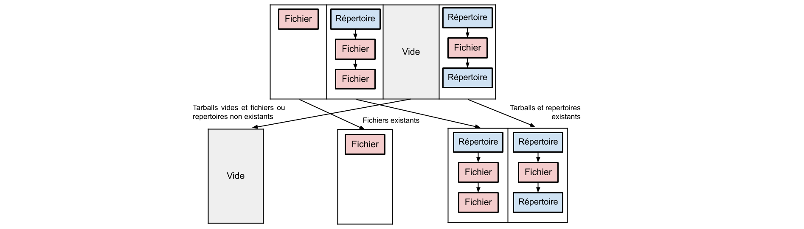

# PROJET DE SYSTEME D'EXPLOITATION

## Fonctionnalités disponibles

Voici les fonctionnalités disponibles du tsh:

* Affichage du nom de l'utilisateur, nom de la machine et du répertoire courant au début du prompt.

* Fonctionnement normal des commandes lorsqu'un tarball n'est pas impliqué.

* Fonctionnement des commandes `ls` (notamment avec l'option -l), `cp` et `rm` (notamment avec l'option -r) , `mv` , `rmdir`, `cat` , `pwd`, `cd` et `exit` lorsque des tarballs sont impliqués. Les options sont uniquement prises en compte lorsqu'elles sont entrées avant n'importe quel argument. La commande `cd` sans argument renvoi dans le répertoire `home/`.

* Fonctionnement normal des commandes lorsqu'on leur donne plusieurs arguments et que des tarballs sont impliqués ainsi que lorsqu'on on leur donne plusieurs arguments, certains impliquant des tarballs, d'autres non.

* Fonctionnement des redirections `>` , `>>` , `2>` , `2>>` , `<` que des tarballs soient impliqués ou non. Fonctionnement des redirections multiples que les tarballs soient impliqués ou non.

* Fonctionnement normal des combinaisons de commande que des tarballs soient impliqués ou non, y compris plusieurs combinaisons de commandes à la suite.

## Architecture

tsh.c est le point central de notre architecture. Le tsh va s'occuper de récupérer ce qui est entré par l'utilisateur grâce à la librairie `readline`. A l'aide de fonctions disponibles dans tar_nav.c , il va par la suite (expliqué plus en détail dans l'explication de tsh) s'occuper de parser le prompt obtenu permettant ainsi de traiter si nécessaire la présence de combinaisons de commandes et de redirection. Dernièrement il va appeler là où les commandes nécessaires avec leurs arguments sur un ou des processus fils.

Chaque commande devant fonctionner sur les tarballs et gérer dans un fichier à son nom possédant un main afin de pouvoir être appelée avec exec depuis le tsh à l'exception de `cd` et `exit` qui sont inhérent au shell. `exit` se contente de mettre à faux la condition qui est vérifiée à chaque tour de boucle du shell.

Afin de gérer `cd` et les tarballs nous avons mis au point un système de sur-couche. Une variable d'environnement nommée "tar" contient le répertoire courant dans les tarballs. Si nous ne sommes actuellement pas dans un tarball alors elle contient uniquement "". `cd`, qui est une fonction codée dans cd.c (afin de mieux séparer le code, mais ce fichier ne contient pas de main) a le même comportement que le `cd` du bash quand les tarballs ne sont pas impliqués. Quand les tarballs sont impliqués, il s'assure de modifier la variable d'environnement "tar" en conséquence.

##  Explication de tsh.c

Le diagramme ci-dessus illustre le fonctionnement de tsh.c sans entrer dans les détails. La boucle tsh continue de tourner dans que l'entier run n'a pas été mis à 0, ce qui n'a lieu que lorsque la commande `exit` est appelée. Grâce a la fonction `get_line()` qui fait appel à la librairie `readline` on récupère le texte entré par l'utilisateur. Après cela, on passe l'entrée récupérer à la fonction `redir()` qui se charge de traiter les potentielles redirections et d'enlever le texte relatif aux redirections du prompt.

On passe ensuite le prompt à la fonction `exec_pipe()` qui va se charger de créer le nombre de processus nécessaires pour traiter les combinaisons de commandes correctement (si elles sont présentes) et de les relier par des tubes anonymes. Une fois ceci fait, ou de manière immédiate s'il n'y a aucune combinaison de commandes à traiter, la fonction `exec_custom()` est appelée, elle se charge de créer un processus fils puis appelle `exec_tar_or_bin()`. Une fonction qui prend en argument un `char ** args` contenant le nom de la fonction et ses arguments/options et terminant par NULL ainsi qu'un boolean indiquant si l'on peut exécuter directement la commande "normale" avec `exec` ou si l'on doit procéder a quelque vérification supplémentaire pour savoir si

nous devons à la place exécuter sa version spécifique aux tarballs.

### Les redirections

Attardons nous sur le fonctionnement de la fonction `redir_out()`, la fonction `redir_in()` fonctionne de manière très similaire.

Cette fonction va parcourir le `char * prompt` fourni en argument et chercher la présence d'un symbole de redirection `>` . Elle va par la suite en analysant les caractères adjacents, déterminer s'il s'agit d'une redirection `>` , `>>` , `2>` ou `2>>` et va créer une chaîne de caractère path contenant le texte

présent entre le symbole de redirection trouvée et le prochain symbole de redirection dans `prompt` ou la fin de `prompt`. Par exemple, "commande > blabla 2> tata" nous fournira commande chaîne "blabla". La fonction prend bien soin de supprimer les espaces superflu. Une fois ceci fait, on va ouvrir un nouveau descripteur avec `open`, les paramètres du descripteur dépendant de quel symbole de redirection nous traitons ( `>` ou `>>`) puis nous

redirigeons la sortie qui nous intéresse, à savoir `STDOUT_FILENO` ou `STDERR_FILENO` selon les circonstances, sur le descripteur que nous venons d'ouvrir, à l'aide de `dup2`. Avant d'appeler `dup2` nous sauvegardons le descripteur remplacé dans une variable global afin qu'il puisse être restauré plus tard. Une fois ceci fait nous enlevons du prompt le symbole de redirection ainsi que le chemin de redirection à l'aide d'un `memmove` (fonction auxiliaire `str_cut`).

Cette boucle va se répéter tant que nous trouvons un symbole `>` ou que nous n'avons pas atteint la fin du prompt. Le processus est très similaire pour `redir_in()` mis à part que le symbole que nous recherchons est `<` et qu'il y a moins de paramètres à prendre en compte.

Le cas ou le fichier vers lequel la redirection doit avoir lieu se situe dans un tarball est un peu plus complexe. En effet, il est impossible de procéder à un simple open du fichier. Voici la stratégie que nous avons décidée d'adopter. Encore une fois, nous nous attarderons plus longuement sur l'implémentation dans `redir_out()` car elle est très similaire à celle de `redir_in`. Lorsque la chaîne de caractère représentant le chemin vers lequel la redirection doit avoir lieu se situe dans un tarball (ce que nous pouvons déterminer grâce à la fonction auxiliaire `goes_back_in_tar()` ) nous copions le contenu du fichier hors du tar, dans le premier répertoire courant qui n'est pas un tarball et avec un nom fixe ( `redir_out` ou `redir_err`). Nous utilisons un nom fixe afin d'éviter les conflits entre deux fichiers différents entre le tarball et l'extérieur, mais portant le même nom.

C'est ensuite ce fichier `redir_out/redir_err` qui sera ouvert lors du open, et le chemin du fichier dans le tarballs sera mémorisé dans une variable globale. Par la suite, lors de la ré-initialisation des descripteurs, on copie de nouveau le contenu de `redir_out/redir_err` dans le tar, mais sous son vrai nom. Puis on supprime le fichier devenu inutile.

Le fonctionnement est similaire pour `redir_in()`, seulement, nous n'avons pas besoin de copier de nouveau le contenu du fichier créer `redir_in` puisque nous l'ouvrons uniquement en lecture.

Une fois cela finit plus tard dans la boucle, une fois que la/les commande(s) ont été exécutées on appelle la fonction `reinit_descriptor()` qui se charge des copies et suppression mentionnées ci- dessus et réinitialise `STDIN_FILENO`, `STDOUT_FILENO` et `STDERR_FILENO` grâce à leurs valeurs que nous avions mites de côté (avec un `dup`) avant de les modifier.

### Les combinaisons de commandes (pipes)

Ici on utilise d'abord la fonction `decompose()` du fichier `tar_nav.c` qui , étant donné un `char * prompt` et un `char * séparateur`, nous renvois un `char ** tokens` contenant tous les morceaux de `prompt` séparés par `séparateur` et finissant pas `NULL`. Ici on utilise `|` comme séparateur. Nous appelons ensuite `exec_pipe()` avec comme arguments, `char ** arg1` et `char ** arg2` qui correspondent aux deux premières commandes à lancer, mais décomposées en fonction de `" "` à l'aide de la fonction `decompose()`. On lui donne également en argument `char ** next`, qui correspond à l'adresse du prochain argument après `arg2` dans le `char **` contenant toutes les commandes sur prompt, décomposées en fonction de `|`. Si next est NULL alors `exec_pipe()` va créer deux processus fils imbriqué et les relier par un tube anonyme en s'assurant que `STDOUT_FILENO` du premier processus à s'exécuter (on s'assure de cela grâce à `wait()`) communique avec `STDIN_FILENO` du second et ce grâce au tube.

Si `next[1]` n'est pas nul, la fonction s'appelle elle-même récursivement, en prenant soin de changer next a `&(next[1])`, permettant ainsi à la fonction de créer autant de processus imbriqués que nécessaire pour qu'on puisse exécuter une combinaison de commande aussi longue qu'on le souhaite.

### La séparation des arguments (dans les tarballs et hors tarballs)

L'objectif de cette séparation, réalisée par la fonction `split_args()`, est de permettre des entrées comme "mkdir toto a.tar/tata" de fonctionner sans problème.

Pour cela, on utilise la fonction `exec_split()` à qui on donne en argument un `char ** args` qui contient tous les arguments de la commande (son nom inclut) et terminant par NULL - obtenu à l'aide de la fonction `decompose()` du fichier `tar_nav.c` qui décompose une chaîne de caractère en fonction d'un caractère, ici, ` `. Cette fonction va parcourir `args` et, à l'aide de la fonction `goes_back_in_tar()`, déterminer si oui ou non - en fonction du répertoire courant , un argument correspond à un chemin dans un tarball. Si l'argument est dans un tarball, rien ne se passera, mais s'il ne l'est pas, on le retire de `args`, et on l'ajoute à `char ** out_tar`, dans lequel on aura au préalable copié le nom et les options présentes dans `args`.

Une fois ceci terminé, on retourne `out_tar`. La fonction `exec_split()` se sert ensuite des deux `char **` obtenus et détermine si elle doit appeler `exec_custom()` sur l'un, l'autre, ou les deux selon leur contenu, la fonction concernée (si on est face à cp ou mv par exemple, avant même d'appeler `split_args()`, on vérifie si les deux premiers arguments disponibles après les options sont toutes les deux hors du tar et alors on appelle la version hors du tar avec `exec_custom`, sinon on appelle la version pour tarballs).

## Algorithmes implémentés

### La fonction true_path()

La fonction `true_path()`, présente dans le fichier `tar_nav.c` est une fonction qui étant donnée un `char * path` , va déterminer son chemin absolu dans les tarballs et le renvoyer. Pour cela la fonction prend en compte le contenu de la variable d'environnement "tar" (mentionnée quelques sections plus tôt). Si le chemin sort d'un tarball, mais ne re rentre pas dans un tarball ( le même ou un autre) alors `true_path()` renverra le reste du chemin une fois sorti du tar. Nous nous servons de cette fonction dans chaque commande ou presque qui doit fonctionner avec les tarballs. La fonction `tar_and_path()` nous permet, pour chaque argument, d'obtenir à l'aide de `true_path()`, le nom du tarball dans lequel se situe le chemin ainsi que le chemin absolu dans ce dit tarball.

Cela permet de traiter des arguments contenant des chemins à l'origine relatifs, incluant notamment des `..`

### Les commandes

#### `mkdir`

Le main de `mkdir` va boucler sur les arguments qui lui ont été fournis et à l'aide de la fonction `tar_and_path()` (mentionnée ci-dessus) va obtenir le nom du tarball à ouvrir ainsi que le chemin absolu du répertoire à créer dans ce même tarball. Nous allons ensuite ouvrir le tarball avec un open puis appeler la fonction `create_dir()` qui prend en argument un descripteur, qui est celui que nous venons d'ouvrir et le chemin absolu obtenu plus tôt. La nécessité d'ouvrir et fermer le descripteur du tarball pour chaque argument viens du fait qu'il est possible que `mkdir` soit appelée avec des arguments qui correspondent à deux tarballs différents. Par exemple : `mkdir a.tar/rep1 b.tar/rep2` depuis le répertoire contenant `a.tar` et `b.tar`. La fonction `create_dir()` va ensuite boucler sur les header du tarball. Si on trouve un header au nom identique à celui du répertoire que l'on souhaite créer, on sort de la fonction. Sinon, nous avons atteint le premier bloc vide situé à la fin du tar, on crée un header que l'on remplit avec la date actuelle et des permissions par défaut donnant tous les droits au propriétaire, de taille 0 et en prenant bien garde

à utiliser le `typeflag` correspondant à un répertoire (à savoir `5` ). On pense également à ajouter un `/` à la fin du nom du header car dans un tarball le nom d'un répertoire se termine toujours ainsi. Puisque la dernière chose que nous avons lu est le dernier bloc vide, à l'aide d'un `lseek` nous remplaçons la tête de lecture d'un bloc en arrière avant d'écrire notre header dans le tarball. Puis pour nous assurer de l'intégrité de la structure du tar, nous écrivons par la suite deux blocs remplis de 0.

#### `rmdir`

Pour cette commande on parcours chaque argument une seule fois. On adapte d'abord l'argument si celui-ci n'est pas un tarball en le modifiant en fonction de la variable d'environnement ou de la présence de `../` grâce la fonction `tar_and_path()` dans tar_nav.c. On parcoure ensuite la boucle qui récupère à chaque tour l'header qui suit le précédant ayant été lu dans le tarball. Pour un répertoire, tant qu'on ne le trouve pas, on stocke la somme de la taille des fichiers lus dans une variable `longueur`. Si le répertoire est trouvé on stocke sa taille dans une variable `supp` ainsi que les fichiers appartenant à celui-ci. Le reste lu après sera stocké dans une variable `dep`. Une fois arrivé à la fin du tarball, on vérifie que la suppression peut avoir lieu, c'est-à-dire si le répertoire existe et qu'il est vide. Pour un tar on vérifie que celui-ci est vide en vérifiant que le premier header lu est le header vide (chaque tarball possède 2 headers vides à la fin).

Pour la suppression d'un répertoire on écrit par-dessus les données à supprimer en se situant dans le tarball à `longueur` octets. Ce sont les données situées à partir de `longueur+supp` octets qui sont réécrites. On termine par la réduction de la taille du tarball avec `ftruncate()`. Pour la suppression d'un tarball on le supprime avec `unlink()`.

#### `cp`
Cette commande comporte trois fonctions principales :

ext_vers_tar : Cette fonction permet de copier un fichier qui n'est pas dans un tarball et la copie dans un tarball.

tar_vers_ext : Cette fonction permet de copier un fichier d'un tarball et de le copier dans un répertoire quelconque.

tar_vers_tar : Cette fonction permet de copier un fichier d'un tarball et de le copier dans un autre tarball.

etdeuxfonctions auxiliaire :

rmtar: qui est la même commande que rm légèrement modifié pour qu'il soit plus facile à utiliser pour 1 argument.

rmdirep: qui est la même commande que mkdir légèrement modifié pour qu'il soit plus facile à utiliser pour 1 argument.

Pour savoir quelle fonction à utiliser, nous regardons les arguments données lors de son appel, en faisant un true_path des arguments données puis en regardant si leurs true_path contienne le nom d'un tar nous pouvons en déduire quelle fonction à utiliser sachant que cp s'appelle de la manière "cp fichier_copié fichier_collé".

Ces trois fonctions fonctionnent de la même manière :

Si le fichier a copié est dans un tarball, nous parcourons le tarball jusqu'à que nous rencontrons l'header contenant le même nom que le fichier copié si nous ne trouvons pas l'header la fonction s'interrompt, si le fichier n'est pas dans tarball alors il sera ouvert normalement s'il existe, nous faisons ensuite le même procédé pour le fichier collé, si la destination du fichier à coller est dans un tarball nous parcourons ces header, si le nom de l'header est le même que le fichier collé il sera alors supprimé, s'il n'existe pas dans les 2 cas nous allons à la fin du tarball et si le fichier a collée n'est pas dans un tarball nous l'ouvrons normalement avec "open". Si le fichier a collée est dans un tarball nous copions 512 octets par 512 octets du fichier copié pour maintenir la structure du tarball sinon pour les fichiers en dehors du tarball nous copions la taille du fichier copié d'un seul coup.

Pour cp -r nous utilisons trois autres fonctions principales :

cp_r_evt : Cette fonction permet de copier un répertoire qui n'est pas dans un tarball et la copie dans un tarball.

cp_r_tve : Cette fonction permet de copier un répertoire d'un tarball et de le copier dans un répertoire quelconque.

cp_r_tvt : Cette fonction permet de copier un répertoire d'un tarball et de le copier dans un autre tarball.

Ces trois fonctions principales fonctionnes aussi de la même manière

En suivant le même principe que pour "cp" nous regardons le type du header, si l'header est un répertoire contenant le path du répertoire copier alors nous créons le répertoire avec "mkdirep" mais avec le path du répertoire collée, si l'header n'est pas un répertoire et contient le path du fichier copiée alors nous réutilisons les trois fonctions principales de "cp" selon le cas et nous continuons jusqu'à la fin du parcours du tarball, de même si le répertoire est en dehors d'un tarball, mais nous parcourons alors le répertoire avec "opendir".

#### `mv`

`mv` ce comporte exactement comme `cp` sauf qu'après la copie du fichier, nous supprimons le fichier.

#### `rm`

Cette commande fonctionne uniquement dans les tarballs bien rangés.

Tout d'abord nous procédons à la vérification de l'existence de l'option -r en argument. La présence celle-ci sera stocké dans une variable pour être rappelé plus tard lors de la suppression des fichiers entrés en argument.

On parcourt ensuite chaque argument une seule fois. Dans ce parcours on vérifie d'abord que l'argument n'est pas appelé sur un tarball lui-même. Si un tarball est en argument et qu'il y a l'option -r on le supprime avec `unlink()`, sinon on procède à la suite. On adapte d'abord l'argument en le modifiant en fonction de la variable d'environnement ou de la présence de `../` grâce la fonction `tar_and_path()` dans tar_nav.c (ex : t.tar/r1/r2$ rm fich nous renvoit r1/r2/fich pour l'argument fich). Une fois cela fait, on parcourt la boucle qui récupère à chaque tour l'header qui suit le précédant ayant été lu dans le tarball. Tant qu'on ne trouve pas le fichier ou répertoire en argument on stocke la somme de la taille des fichiers lus dans une variable `longueur`. Si le fichier ou répertoire est trouvé on stocke sa taille dans une variable `supp` ainsi que les fichiers appartenant à celui-ci si c'est un répertoire. Le reste lu après sera stocké dans une variable `dep`. Une fois arrivé à la fin du tarball, on vérifie que la suppression peut avoir lieu, c'est-à-dire si le fichier existe et que l'option -r est présente si c'est un répertoire à supprimer.

Pour la suppression, on écrit par-dessus les données à supprimer en se situant dans le tarball à `longueur` octets. Ce sont les données situées à partir de `longueur+supp` octets qui sont réécrites. On termine par la réduction de la taille du tarball avec `ftruncate()`.

#### `ls`

Cette commande fonctionne uniquement dans les tarballs bien rangés.

Tout d'abord nous procédons à la vérification de l'existence de l'option -l en argument. La présence celle-ci sera stocké dans une variable pour être rappelé plus tard lors de l'affichage des fichiers entrés en argument.

Si la commande n'a pas d'arguments (l'option -l non concernée) il y a deux cas. Si la variable d'environnement est dans un répertoire du tar, on "imite" le comportement du ls appelé depuis un tar avec en argument le nom du répertoire. Sinon on choisit d'afficher tous les fichiers ou répertoires du tarball ayant une profondeur de 0 (c'est-à-dire qu'ils n'appartiennent pas à aucun répertoire). Il n'y aura qu'un seul parcours du tarball.

Si la commande prend au moins un argument, on parcourt le tarball qu'autant d'arguments qu'il y a. On adapte d'abord l'argument en le modifiant en fonction de la variable d'environnement ou de la présence de `../` grâce la fonction `tar_and_path()` dans tar_nav.c.

Dans le parcours du tarball, on parcourt la boucle qui récupère à chaque tour l'header qui suit le précédant ayant été lu dans le tarball.

Une structure a été mise en place pour l'affichage ordonné des éléments. C'est un tableau de la longueur du nombre d'arguments ou de longueur 1 s'il n'y a pas d'arguments. Chaque case correspond à un argument et possède initialement une liste vide (`struct node` dans lib.c). Cette liste pourra stocker les informations de l'élément à afficher notamment son header. Sa taille varie si c'est un répertoire, sinon si c'est un fichier elle sera de taille 1 et si le fichier n'est pas trouvé elle sera vide.

À la fin de la boucle on trie ce tableau en 3 parties, le premier est un tableau de listes correspondant aux tarballs vides et fichiers/répertoires non existants, le deuxième correspond aux fichiers existants et le troisième aux tarballs, répertoires existants. Cela nous permettra d'afficher d'abord les erreurs puis les fichiers suivis par les répertoires.

Pour l'affichage la fonction `afficher()` dans lib.c s'occupera de récupérer les données nécessaires d'un header et les convertir en `char *`.

Un char* "mutable" (`struct affichage` dans lib.c) a été créé pour concaténer toutes ses valeurs et obtenir un seul `char *` à afficher. L'affichage se fait à la fin du programme.

#### `cat`

La version tarballs de `cat` s'occupe uniquement de gérer les arguments se trouvant dans les tarballs. Si `cat` est appelée sans argument, `tsh` fera en sorte que ce soit la version de base de `cat` qui soit exécutée. Le main de `cat` va boucler sur tous les arguments et à l'aide de `tar_and_path()` évoqué plus haut, va déterminer le fichier tar à ouvrir ainsi que le chemin absolu de l'argument à l'intérieur du dit tarball. Il va ensuite ouvrir ce tarball puis appeler la fonction `cat_tar()` qui prend deux arguments. Un descripteur, qui est celui que nous venons d'obtenir et le chemin absolu un `char *`. La nécessité d'ouvrir puis de fermer le descripteur à chaque fois plutôt que de l'ouvrir une unique fois vient du fait qu'on peut tout à fait appeler cat avec deux arguments se trouvant dans deux tarballs différents. Par exemple : `cat a.tar/a.txt b.tar/b.txt`. La fonction `cat_tar()` va boucler sur les en-têtes du tarball en testant à chaque fois le nom. Si on arrive au bout du tarball sans avoir trouvé un en-tête dont le nom est égal au fichier que l'on cherchait, alors on sort de la fonction et on indique dans une erreur que le fichier n'existe pas. Si en revanche on trouve un en-tête dont le nom est égal au fichier que l'on cherche, on sort de la boucle.

Par la suite, nous continuons à lire le contenu du fichier, situé après l'en-tête, par blocs de 512 octets (selon la nome posix) et nous les écrivons sur `STDOUT_FILENO`. La taille du fichier spécifiée dans l'header nous permet de déterminer à l'avance le nombre de bloc devant être lus.

#### `pwd`

`pwd` construit une chaine de caractère `entry` qu'elle va ensuite afficher dans`STDOUT_FILENO` à l'aide de la fonction `prints()`, une des fonctions du fichier `print.c` qui contient des alternatives à `printf()` à base de `write()`. `pwd` va d'abord récupérer le répertoire courant à l'aide de `getcwd()` ensuite on récupère le contenu de la variable d'environnement `tar`. Si elle est vide on s'arrête là, on écrit ce qu'on a récupérée dans `STDOUT_FILENO` et nous avons fini. Sinon on concatène le contenu de cette variable d'environnement à ce que nous avons récupéré préalablement, puis enfin nous écrions le résultat et nous avons fini.

### `exit`

La boucle de tsh tourne tant que `int run` , une variable globale, est à 1. Lorsque l'on détecte que la commande `exit` a été entrée on se contente de mettre `run` à 0.

### `cd`

Dans un premier temps, si l'on détecte qu'aucun argument n'a été fourni à `cd` nous allons renvoyer l'utilisateur au répertoire `home` . Pour cela nous construisons une schaîne de caractère contentant `/home/` suivi du nom de l'utilisateur que nous récupèrons grâce à `getlogin()` puis nous y accèdons à l'aide de la fonction `chdir()` et nous avons fini.

Autrement, nous vérifions ensuite si nous devons simplement avoir le comportement normal de `cd` ou si des tarballs sont impliqués et que dans ce cas nous devons modifier le contenu de la variable d'environnement `tar`. Si nous sommes dans le cas impliquant des tarballs - c'est à dire que le répertoire courant se situe dans un tarball ou que l'argument contient un .tar alors tout d'abpord nosu donnons l'argument à la fonction `path_is_valid()` située dans le fichier `tar_nav.c` Cette fonction, étant donné un chemin, va déterminer le chemin absolu, en prenant en compte mais supprimant les `..` puis va vérifier si ce chemin est valide. A savoir, si le tarball correspondant existe bien dans le répertoire ou nous nous trouvons et si le répertoire auquel nous tentons d'accèder existe bien dans ce même tarball. Si le chemin n'est pas valide la fonction nous retournera  `NULL` si il l'est il nous renverra le chemin complet absolu dans les tarballs. Si nous devons simplement sortir d'un tarball elle renverra la chaîne de caractère vide enfin, si nous sortons d'un tarball mais qu'il reste un chemin après cela ( par example, nous sommes dans `a.tar` et nous voulons acceder à `../rep` ) alors cela renverra le chemin a partir du moment ou nous somme sortis du tarball.
Si le chemin retourné commence bien par un tarball alors nous nous contentons de mettre à jour la variable d'environnement `tar` . Si ce n'est pas le cas, c'est que nous comme sortis du tar et qu'il reste encore un chemin à traiter, nous appellons donc récursivement cd sur ce résultat obtenu. Autement, si aucun tarball n'est impliqué, nous entrons dans le comportement de `cd` " de base ".

Nous commençons per vérifier si le chemin est absolu ou relatif, pour cela on verifie si le premier caractère du path donné en argument est un \ . Si oui, nous utilisons chdir pour accèder à cette première partie du chemin immédiatement. Une fois ceci fait nous utilisons de nouveau chdir pour accèder au reste du path. Si le chemin est relatif on n'apport aucune modification au path et on y accède dirèctement avec chdir.
